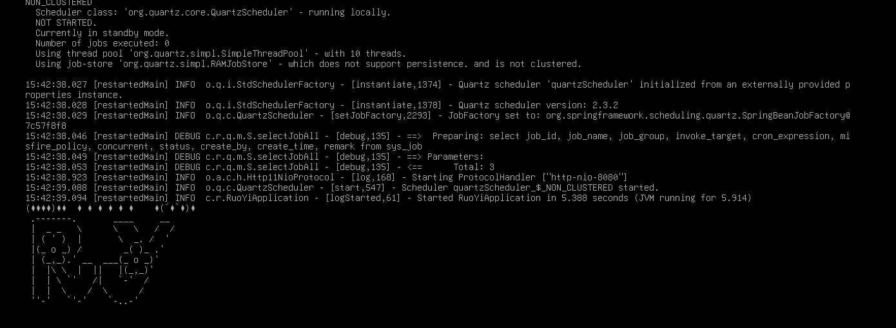
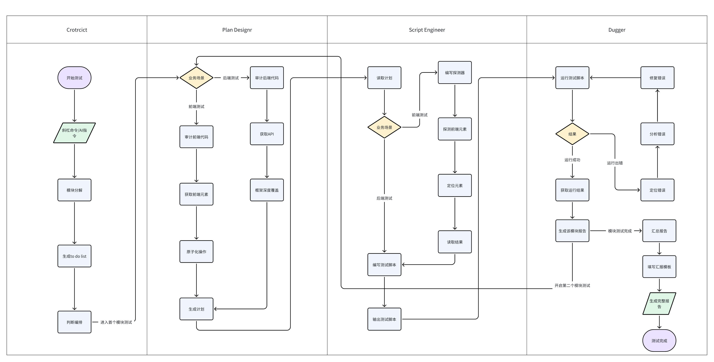

# CodeSentinel自动化测试工作流

## 项目简介

**CodeSentinel**是一个为 AI 编码时代设计的**高级自动化测试工作流**。它将自动化测试工作流深度集成到大语言模型 (LLM) 的开发流程中，旨在解决传统测试需要花费大量人力时间与测试过程常常重复且枯燥的问题。
系统通过多模态架构，利用专业的 AI 角色，实现从代码审计、测试计划生成、测试用例设计、测试脚本编写，到自动执行和问题自我修复的全链路自动化。CodeSentinel 核心价值在于将测试工作成为一个高度自动化且高度稳定性的工作流，确保每一个测试的模块都可以被AI进行完整链路与高覆盖度的测试

## 系统架构的简要描述
CodeSentinel 采用多模态架构(Multimodal) 的模块化架构，将复杂的测试流程解耦为不同的Agent模块和执行环境，总的来讲就是“让专业的人做专业的事情


- 编排层(CoStrict/LLM)：
    - 作为中央控制器，我们认为这是AI的大脑，理解用户提出的指令，识别to_do_list调用正确的 AI Agent，并根据运行的结果驱动流程的推进（成功）或循环（失败）。
- AI Agents 层 (Custom Modes)：

| 角色名称 | 核心职责 | 输入与输出 | 核心工具/架构 |
| :--- | :--- | :--- | :--- |
| **Plan Designer** (测试计划设计师) | 审计代码，制定详细的测试计划，包括编写测试用例、定义测试步骤及测试判定标准。 | **输入**：源代码 / 需求文档<br>**输出**：结构化测试用例 (JSON) | 业务逻辑分析、JSON |
| **Script Engineer** (脚本工程师) | 阅读测试计划，编写探测器以定位前端元素，获取网页元素并生成自动化脚本。 | **输入**：结构化用例 (JSON)<br>**输出**：自动化测试脚本 | Playwright (前端) / Pytest (后端) |
| **Debugger** (调试工程师) | 执行测试脚本，监控运行状态，修复脚本运行错误并总结最终测试结果。 | **输入**：测试脚本<br>**输出**：测试报告 / 修复后的脚本 / 结果总结 | Python 调试工具、日志分析 |

- 执行与反馈层
    - 待测项目代码仓库，实际运行项目（前端/后端），运行结果信息反馈

- 拓展：
在我们的实际开发过程中，我们发现该工作流存在一些感知局限性问题以及模型的生成边界限制的问题，因此我们为该工作流添加了一些拓展来让模型更好的完成该测试工作

    -  黑盒页面探测拓展：在实际开发过程中我们发现因为vue页面是动态渲染的架构，因此AI模型可能会出现因为无法得知前端页面实际的页面的元素以及元素的位置而出现定位错误以及自行编造信息的情况，因此我们的为他添加了探测器来正确获取前端页面的元素。
    - 规范测试报告生成拓展：AI生成的内容具有随机性，因此我们需要给AI提供一个统一化模板拓展，来保证他每次生成的模板都符合我们的规定。

## 工作流介绍



##  项目目录结构
```
.
├── 工作区/         # AI 进行测试工作的核心目录：存放计划、脚本及生成汇报
├── .roo/          # 存放 CoStrict 模型的提示词（定义 AI 的行为边界）
├── /         # 汇总各个模型的提示词模版
└── to_do_list     # 测试工作流优化说明 (README)
```
---
## 工作流测评测试报告
以下是我们团队对该工作流进行了多次测试后得到的一个大致测评报告

### 前端测试部分
1. 核心指标

| 统计项 | 数值 | 备注 |
| :--- | :--- | :--- |
| **总测试轮次** | 10 | 对应原始数据序号 2-10 |
| **成功次数** | 7 | 整体成功率 70% |
| **失败次数** | 3 | 主要集中在新增/修改模块 |
| **人工干预** | 0 | 流程实现了全自动化 |
| **总 Credit 消耗** | 430.0 | 均值约 47.8 / 次 |

2. 模块表现明细

| 模块范围 | 成功率 | 消耗特征 | 常见问题 |
| :--- | :--- | :--- | :--- |
| **登录 (/login)** | 100% | 低 (avg. 22) | 表现极佳，轻微重试即可成功 |
| **用户修改 (修改)** | 60% | 中 (avg. 31.5) | 存在“不符合预期”的情况 |
| **用户新增 (新增)** | 60% | 高 (avg. 71) | 复杂度最高，易在多用例运行时失败 |
| **综合测试** | 新增+删除+修改 | 40% | 中 (avg. 37.5) | 包含多次操作，容易出现失败案例 |

>注：本测评存在一定的缺陷，由于考虑到本次的比赛时间紧张和credit的限制因此没有能够进行足够多次数的测评。
3. 
### 后端测试部分
---